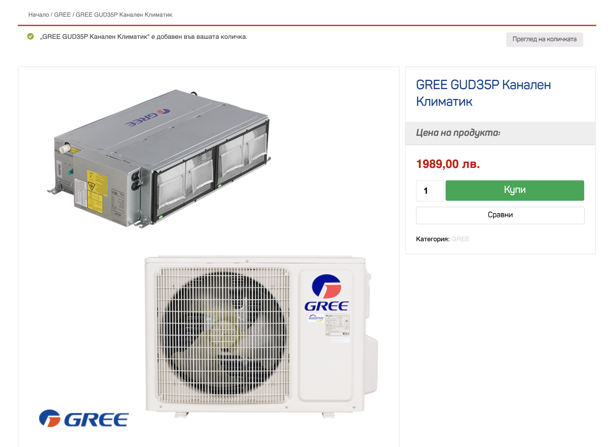
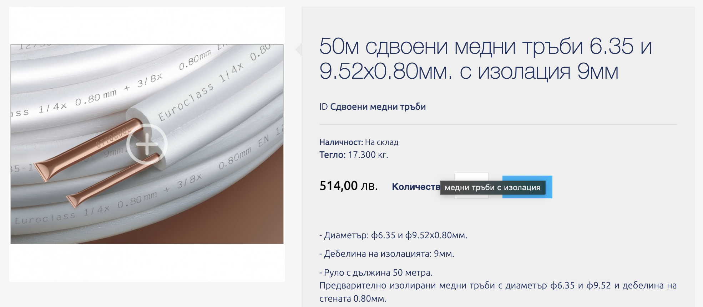
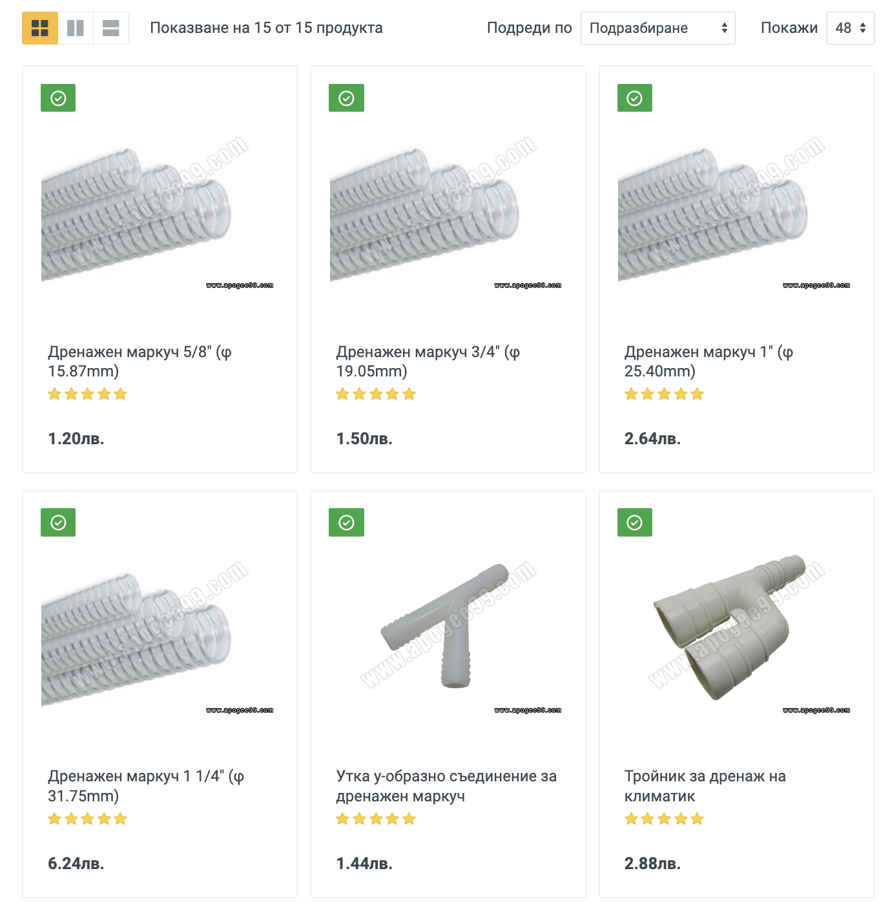
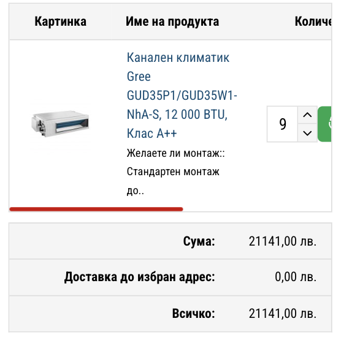

# Оферта за климатици

:::danger първа забележка

Предложеният климатик Gree GUD35P/A-T, е за помещения до 35 м².
Ще бъде необходимо да се избере по-мощен модел, за да се осигури оптимално охлаждане и ефективност.

:::

| **Модел**         | **BTU**   | **Охладителен капацитет** | **Препоръчителна площ**  |
|-------------------|-----------|---------------------------|--------------------------|
| Gree GUD35P/A-T    | 12,000    | 3.5 kW                    | До 35 м²                 |
| Gree GUD50T/A-T    | 18,000    | 5.0 kW                    | 50 - 60 м²               |
| Gree GUD71T/A-T    | 24,000    | 7.1 kW                    | 80 - 100 м²              |

## Цена на климатика

При обикновено [търсене в Гугъл](https://www.google.com/search?q=Gree+GUD35P%2FA-T+%D1%86%D0%B5%D0%BD%D0%B0&sca_esv=0a3e250173e3dd9d&rlz=1C5CHFA_enBG938BG938&sxsrf=ADLYWIK9_yo4S6d7UoeGI0ucXgBbuGetzg%3A1729368941252&ei=bRMUZ5qND9GK7NYPlvmaiQY&ved=0ahUKEwja97aroZuJAxVRBdsEHZa8JmEQ4dUDCBA&uact=5&oq=Gree+GUD35P%2FA-T+%D1%86%D0%B5%D0%BD%D0%B0&gs_lp=Egxnd3Mtd2l6LXNlcnAiGEdyZWUgR1VEMzVQL0EtVCDRhtC10L3QsDIEECMYJzIIEAAYgAQYogRI8xNQ1gFY7BJwBHgBkAEAmAGiAaABvwiqAQMwLji4AQPIAQD4AQGYAgygAu8IwgIHECMYsAMYJ8ICChAAGLADGNYEGEfCAgYQABgWGB7CAgsQABiABBiGAxiKBcICBRAhGKABmAMAiAYBkAYGkgcDNC44oAf9Gg&sclient=gws-wiz-serp)
резултатите показват по-ниски цени **с ДДС** от предложената ни цена **БЕЗ ДДС** `2080.00лв`

## Тръба медна с изолация ф 6,35 /ф 9.52)

- Цена в нета `514.00лв` за `50 метра` което прави цена от `10.28 лв/м` 
- За `139 метра` е предложена цена от **`6255 лв без ДДС`**

- За `139 метра` излиза **`1428.92 лв с ДДС`**

## Цена на тръби за конденз

Цените на тръбите за конденз варитат от `1.20 лв/м` до `6.24 лв/м` **с ДДС** спрямо ширината и дебелината, в нашата оферта е посочена цена от `14.00 лв/м` **без ДДС** ?!

## Стойка стенна за външно тяло

- Цена от офертата **`60лв без ДДС`**
- Средна цена в нета **`35лв с ДДС`**

## Оферта от Васко

| №  | Description                                                                                                    | Unit | Quantity | Unit Price | Total Price  |
|----|----------------------------------------------------------------------------------------------------------------|------|----------|------------|--------------|
| 1  | Gree GUD35P/A-T Вътрешен термопомпен агрегат - канален тип за скрит монтаж, комплект с въздушен филтър и стенен | бр.  | 9        | 2080,00    | 18 720,00    |
| 2  | Тръбен път (Тръба медна с изолация ф 6,35 /ф 9.52)                                                              | м.л. | 139      | 45,00      | 6 255,00     |
| 3  | Комуникация - ШВПС 6х1.5 м2                                                                                     | м.л. | 139      | 6,00       | 834,00       |
| 4  | Доставка и монтаж на тръби за конденз                                                                            | м.л. | 62       | 14,40      | 892,80       |
| 5  | Допълнителен Фреон R410A                                                                                         | кг.  | 3        | 90,00      | 270,00       |
| 6  | Проба с азот                                                                                                     | бр.  | 9        | 20,00      | 180,00       |
| 7  | Укрепваща конструкция                                                                                            | бр.  | 9        | 25,00      | 225,00       |
| 8  | Стенна вентилационна решетка 800/150                                                                             | бр.  | 9        | 56,00      | 504,00       |
| 9  | Пленум между вътрешно тяло и решетка                                                                             | бр.  | 9        | 83,00      | 747,00       |
| 10 | Смукателна решетка 600/600 (Ревизионен отвор)                                                                    | бр.  | 9        | 85,00      | 765,00       |
| 11 | Стойка стена за външно тяло                                                                                      | бр.  | 9        | 60,00      | 540,00       |

**`29 932,80лв`**  

**ДДС (20%)** **`5 986,56лв`**  
**Тотал** **`35 919,36лв`**

## Оферта от [vimax.bg](https://vimax.bg/kanalen-klimatik-gree-gud35p-gud35wnhat-12-000-btu.html)

